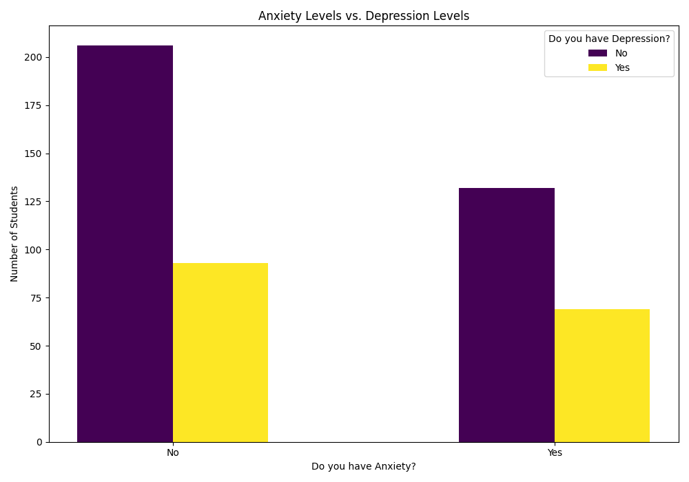
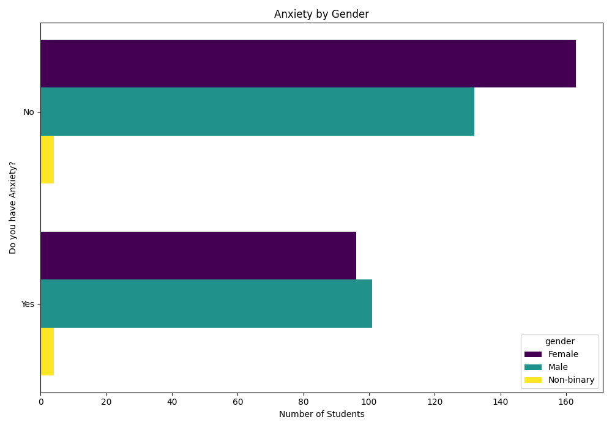
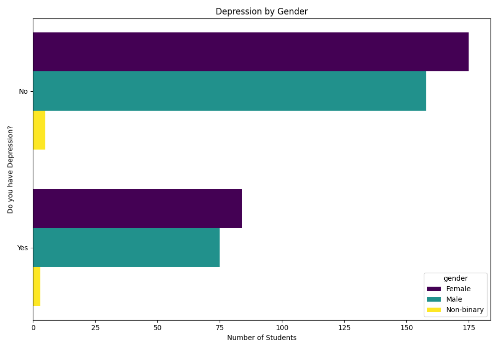
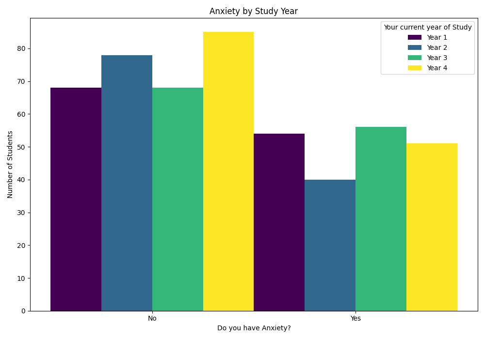
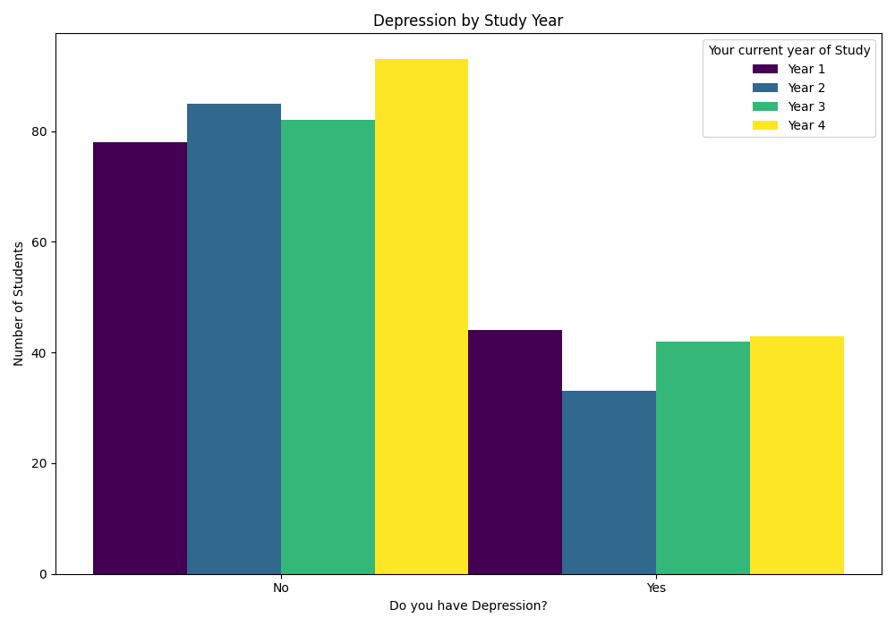
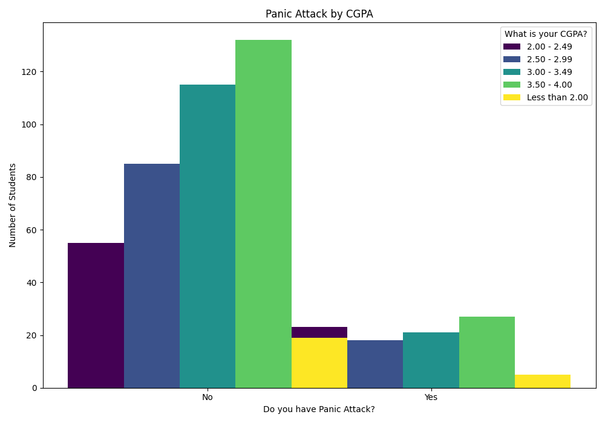

# 📊 Mental Health Trends in Students – Data Analytics Project

### 🧠 A Data-Driven Exploration of Student Well-Being

> This project leverages data analytics to gain insights into mental health patterns among students. We explore relationships between anxiety, depression, demographics, academic performance, and more to support awareness, policy-making, and interventions.

## 📂 Project Structure

graph TD
    A[Student Mental Health.csv] --> B[Mental health.py]
    B --> C[Data Cleaning & EDA]
    C --> D[Visualization Outputs]
    B --> E[Outlier Detection]
    B --> F[Data Transformation]
    subgraph Outputs
        D1[age_distribution_histogram.png]
        D2[gender_distribution_piechart.png]
        D3[students_by_year_gender_countplot.png]
        D4[anxiety_vs_depression_countplot.png]
        D5[anxiety_by_gender_countplot.png]
        D6[depression_by_gender_countplot.png]
        D7[anxiety_by_study_year_countplot.png]
        D8[depression_by_study_year_countplot.png]
        D9[panic_attack_by_cgpa_countplot.png]
    end
    D --> D1 & D2 & D3 & D4 & D5 & D6 & D7 & D8 & D9

## 📁 Dataset Description

### 📌 Primary Dataset: `Student Mental health.csv`

Demographics: Age, gender, year of study, CGPA
Mental Health Indicators: Anxiety, depression, panic attacks
Survey Responses: Binary or ordinal answers (e.g., Yes/No, High/Low)

## 🧪 Analysis Pipeline

1. Load & Clean Data
2. Exploratory Data Analysis (EDA)
3. Outlier & Anomaly Detection
4. Transform Variables
5. Generate Visual Insights
6. Derive Patterns & Correlations

### Anxiety & Depression Patterns

| Chart                                                         | Description                                |
| ------------------------------------------------------------- | ------------------------------------------ |
|  | Compare anxiety and depression frequencies |
|          | Gender-wise breakdown of anxiety           |
|    | Gender-wise breakdown of depression        |
|        | Anxiety distribution by academic year      |
|  | Depression distribution by academic year   |
|    | CGPA category vs panic attack frequency    |

## 📜 Technologies Used

  Python (Pandas, Matplotlib, Plotly)
  IDLE 
  CSV Data Handling
  Git for Version Control

## 🧠 Future Enhancements

* Sentiment analysis from open-ended responses
* Time series analysis if longitudinal data is added
* Correlation with sleep/activity data (if wearable data is integrated)
* More granular modeling: logistic regression, clustering, etc.

